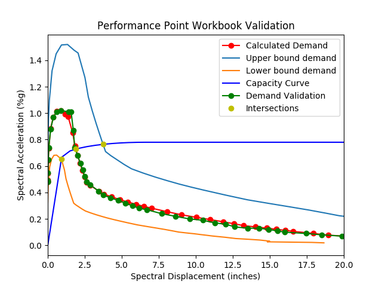
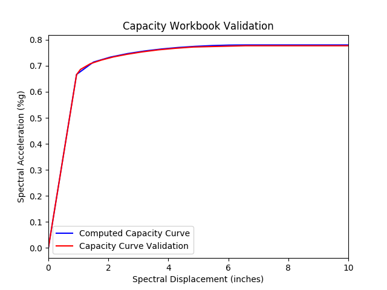

Validation
==============

Workbook Comparison
---------------------

Structure profile:
  - model building type: 'PC1'
  - seismic design level: 'high'
  - basis ID: 7
  - height (feet): 24
  - stories above ground: 2
  - year built: 1990
  - performance rating: 'very_poor'
  - data quality rating: 'poor'

Hazard:
  - magnitude: 7.9
  - beta: .4
  - r_rup: 11.18

.. image:: ../figures/acc_diff.png
   :alt: Spectral acceleration validation image
   :align: center

.. image:: ../figures/disp_diff.png
   :alt: Displacement validation image
   :align: center

ShakeCast example
-------------------

Using 3 input spectra (0.3s, 1.0s, and 3.0s)

.. code-block:: python

    hazard = [
        {'x': .03, 'y': 1.1377},
        {'x': 1.0, 'y': .8302},
        {'x': 3.0, 'y': .348}
    ]

    hazard_beta = .5

    mag = 6.7

    r_rup = 20

.. image:: ../figures/perf_point2.png
   :alt: ShakeCast example performance point image
   :align: center

.. image:: ../figures/impact_fig.png
    :alt: Impact example image
    :align: center